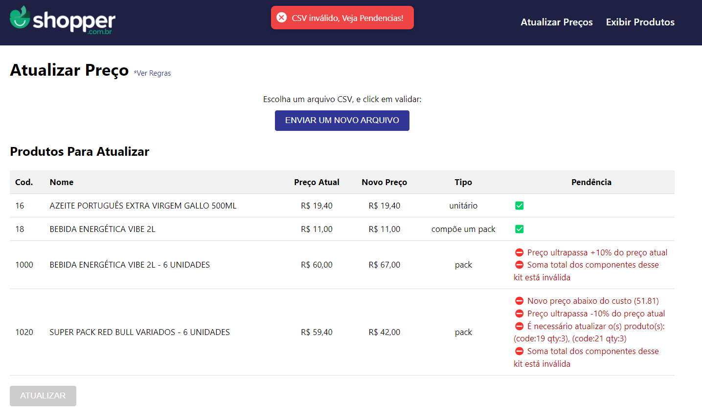

# 🚀 Desafio FullStak Shopper.com.br (Repositório FrontEnd - VERSÃO 2)

Bem-vindo(a). Este é o desafio Front end, para a Shopper.com.br!
O objetivo deste desafio é um teste técnico para avaliar habilidades em desenvolvimento de software.

## [Projeto Online](https://shopper-frontend-v2.vercel.app)

- https://shopper-frontend-v2.vercel.app
- Por se tratar de um servidor backend gratuito de alcance internacional, é possível que a primeira exibição da página leve mais tempo do que o habitual.

### Screenshots



# 🧠 Contexto

O desafio será implementar uma ferramenta, que permita atualizar os produtos de forma massiva usando com isso o envio de um arquivo csv, e com recursos adicionais para evitar erros que possam prejudicar o negócio.

## Resposabilidades 
> **Time Compras:** Responsável por definir os preços e gerar um arquivo CSV, contendo código do produto e o novo preço que será carregado.

> **Time Financeiro:** Controla o faturamento, solicitou que o sistema impeça que o preço de venda dos produtos fique abaixo do custo.

> **Time de Marketing:** Solicita que o sistema impeça qualquer reajuste maior ou menor do que 10%.

## Produtos que são pacotes kits
Estabeleceu-se a regra que, ao reajustar o preço de um pacote, o mesmo arquivo deve conter os reajustes dos preços dos componentes do pacote de modo que o preço final da soma dos componentes seja igual ao preço do pacote.
***A ferramenta deve impedir atualizações de preço que quebrem essa regra.***

1. Exemplo 1:
    - PACK GUARANA 1L – 6 Unidades = R$ 24,00
    - Preço cada und. Pack: R$ 4,00 * 6 = R$ 24,00
    - ::::::::::: NOVO PREÇO :::::::::::::::
    - PACK GUARANA 1L – 6 Unidades = R$ 30,00
    - Preço cada und. Pack: R$ 5,00 * 6 = R$ 30,00
<br><br>
2. Exemplo 2:
    - ESCOVA DE DENTES 1und R$ 10,00 + PASTA DE DENTE 1und R$ 15,00
    - TOTAL = R$ 10,00 + R$ 15,00 = R$ 25,00
    - ::::::::::: NOVO PREÇO :::::::::::::::
    - ESCOVA DE DENTES 1und R$ 20,00 + PASTA DE DENTE 1und R$ 15,00
    - TOTAL = R$ 20,00 + R$ 15,00 = R$ 35,00


## 📋 REQUISITOS

Chegou a hora de colocar a mão na massa!
- [x] O sistema deve permitir que o usuário carregue o arquivo de precificação
- [x] O sistema deve ter um botão chamado VALIDAR
    - [x] Todos os campos necessários existem?
    - [x] Os códigos de produtos informados existem?
    - [x] Os preços estão preenchidos e são valores numéricos validos? 
    - [x] Os códigos de produtos informados existem?
    - [x] Valida: Preço não pode estar abaixo do custo
    - [x] Valida: Reajuste maior ou menor do que 10%
    - [x] Nova Regra: Valida Tipo de produto, é unitário, é um kit, ou faz parte de um kit
    - [x] Valida: Se é um Kit - o csv deve conter os reajustes dos preços dos componentes do pacote.
        - [x] Valida: verificar se preço final da soma dos componentes seja igual ao preço do pacote.
- [x] Finalizar Validação: e exibir Código, Nome, Preço Atual, Novo Preço
- [x] Exibir ao lado de cada produto qual regra foi quebrada
- [x] Habilitar botão ATUALIZAR, somente se todas as linhas estiverem validadas
    - [x] Ao clica em ATUALIZAR, o sistema deve salvar o novo preço no banco de dados, com tela pronta para o envio de um novo arquivo. 
    - [x] Nova Regra: Valida Tipo de produto, é unitário, é um kit, ou faz parte de um kit
    - [x] O preço de custo dos pacotes também deve ser atualizado como a soma dos custos dos seus componentes.  


## 👨‍💻 Instalação

### Frontend

1. Clonar este repositório
```bash
git clone https://github.com/kleutons/shopper-frontend-v2
```

2. Configurar variável de ambiente para apontar a url do servidor backend, arquivo [.env](/.env)
```
VITE_REACT_APP_API_URL=http://localhost:3002
```

3. Instalar dependência 
```bash
npm install
```

4. Executar Front-end
```bash
npm run dev
```

5. Acessar WebSite FrontEnd na porta 5173
```
http://localhost:5173/shopper-frontend-v2
```

### Servidor BackEnd
Siga os passos descritos no Readme do repositório referente ao servidor backend: 
- https://github.com/kleutons/shopper-backend-v2

## 👨‍💻 Sobre Mim
### Made with 💙 by [@kleutons](https://github.com/kleutons)

### Contato
- [LinkedIn](https://www.linkedin.com/in/kleuton-novais/)
- [Portfólio](https://kleuton.dev)

###
Aguardo seu feedback e sugestões sobre esta solução.